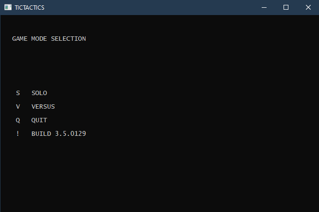
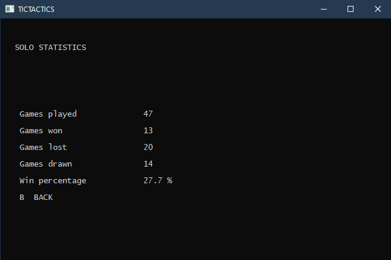
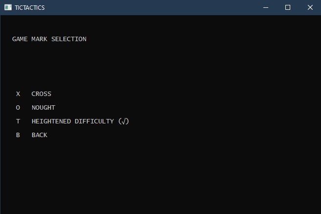
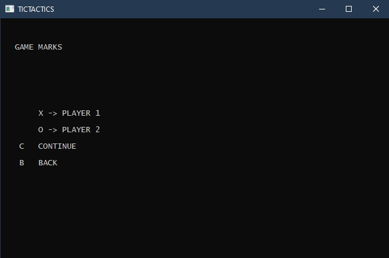
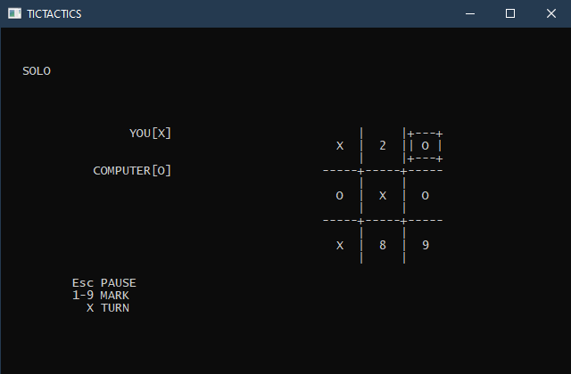
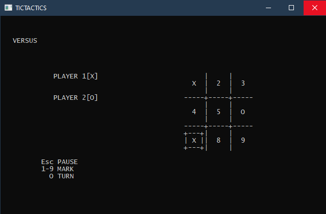
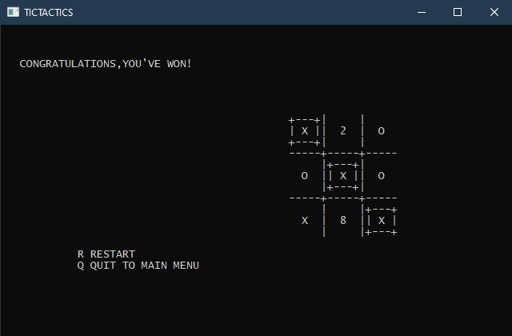

# tictactics

Tictactics is a simple program written in **C++** for the familiar tic-tac-toe (or Crosses and Noughts) game. You can play either with the CPU (**SOLO**) or with a friend (**VERSUS**).

### Screenshots

    
      
    
      
    
      
    
      
    
      
    
      
    

#### The contents of this repo

- Source Code in C++ (TicTacticsx.x.cpp).
- Executable of the program (TicTacticsx.x.exe).
- A sample statistics file (file4) which records:
  - Number of games played in SOLO/VERSUS mode.
  - Number of games won/lost/drawn in SOLO/VERSUS mode.
  - Corresponding win percentages for the singleplayer/player 1/player 2.

*Quick Tip*: To use the given sample statistics file, place *file4* in the same directory as the executable.

##### Heightened Difficulty

If you are playing **SOLO**, you can opt(or not) for the heightened difficulty by using the appropriate key to turn it ON **(")** (or OFF **( )** ).

By turning it on, you may never be able to win a game again!!!
